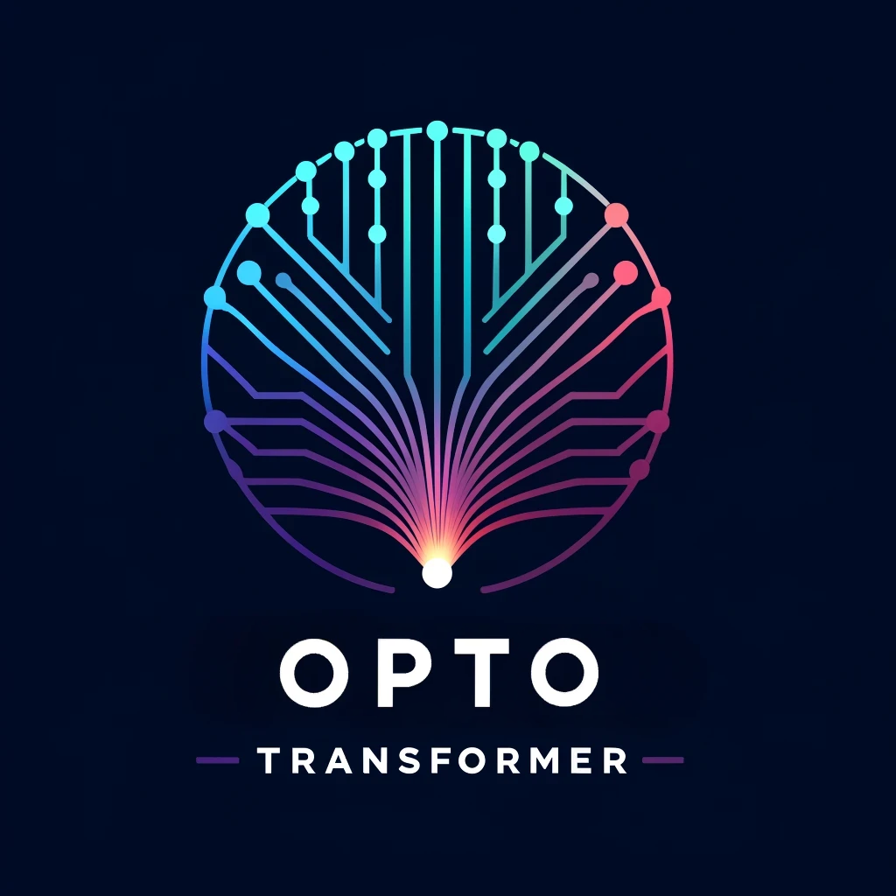

 

   

  
  

###

  
  
  

###

  

###

  
  
  
  
  
  
  
  
  
  
  
  
  
  
  
  
  
  
  
  
  
  
  

          
###

    
    
    
   
    
    
    
    
    

###

  

###

  
  

###
